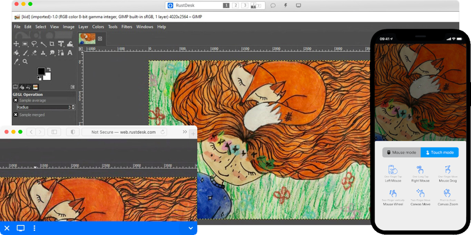

<!--
Важно: этот README был автоматически сгенерирован <https://github.com/YunoHost/apps/tree/master/tools/readme_generator>
Он НЕ ДОЛЖЕН редактироваться вручную.
-->

# RustDesk Server для YunoHost

[](https://ci-apps.yunohost.org/ci/apps/rustdesk-server/)  

[](https://install-app.yunohost.org/?app=rustdesk-server)

*[Прочтите этот README на других языках.](./ALL_README.md)*

> *Этот пакет позволяет Вам установить RustDesk Server быстро и просто на YunoHost-сервер.*  
> *Если у Вас нет YunoHost, пожалуйста, посмотрите [инструкцию](https://yunohost.org/install), чтобы узнать, как установить его.*

## Обзор

Self-host your own RustDesk server. RustDesk is a full-featured open source remote control alternative for self-hosting and security with minimal configuration.

**Поставляемая версия:** 1.1.11-1~ynh3

## Снимки экрана



## Документация и ресурсы

- Официальный веб-сайт приложения: <https://rustdesk.com/>
- Официальная документация администратора: <https://rustdesk.com/docs/en/>
- Репозиторий кода главной ветки приложения: <https://github.com/rustdesk/rustdesk-server>
- Магазин YunoHost: <https://apps.yunohost.org/app/rustdesk-server>
- Сообщите об ошибке: <https://github.com/YunoHost-Apps/rustdesk-server_ynh/issues>

## Информация для разработчиков

Пришлите Ваш запрос на слияние в [ветку `testing`](https://github.com/YunoHost-Apps/rustdesk-server_ynh/tree/testing).

Чтобы попробовать ветку `testing`, пожалуйста, сделайте что-то вроде этого:

```bash
sudo yunohost app install https://github.com/YunoHost-Apps/rustdesk-server_ynh/tree/testing --debug
или
sudo yunohost app upgrade rustdesk-server -u https://github.com/YunoHost-Apps/rustdesk-server_ynh/tree/testing --debug
```

**Больше информации о пакетировании приложений:** <https://yunohost.org/packaging_apps>
